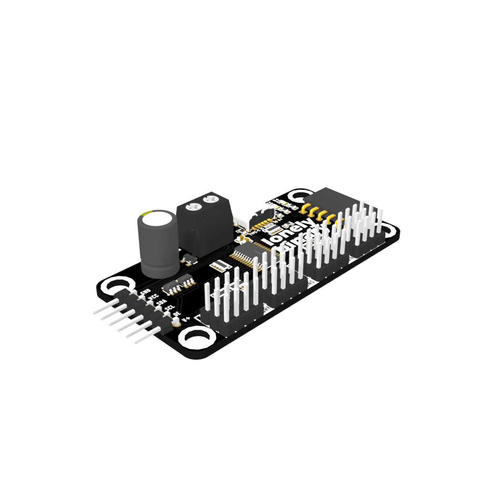
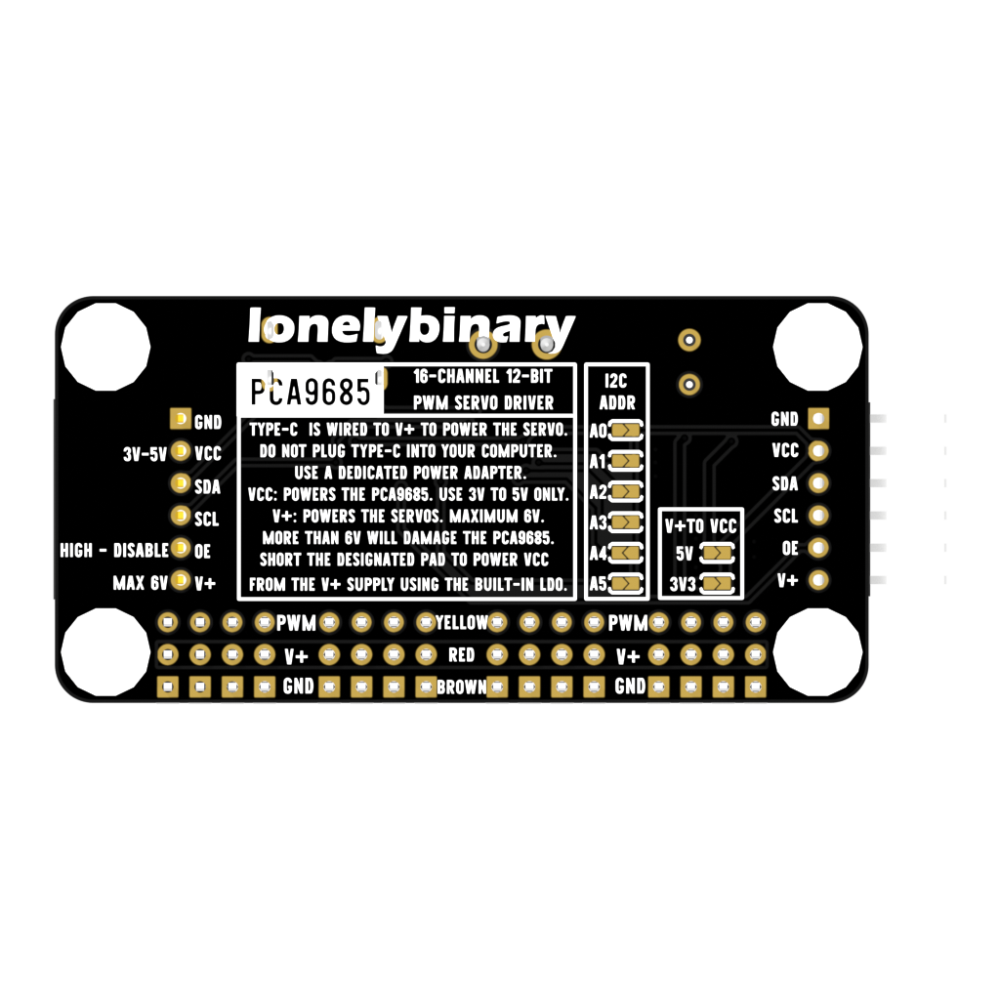

# PCA9685 16-Channel 12-Bit PWM Servo Driver



Sixteen independent PWM channels on two wires. An NXP PCA9685 generates the
pulses on its own 25 MHz oscillator, so the host only sends a number over I²C
and then goes back to whatever else it was doing. Six address pins mean you can
hang a stack of these on one bus and drive well past a hundred servos from a
single microcontroller.

This board is the PCA9685 with the parts that usually go wrong already fixed:
USB-C or a screw terminal for the servo rail, reverse-polarity protection on
both, two on-board regulators so the logic rail can come from the same supply,
I²C pull-ups fitted, a 220 Ω series resistor on every channel, and a 1000 µF
bulk capacitor sitting right on V+.

| | |
| --- | --- |
| Controller | NXP PCA9685PW, TSSOP-28 |
| Channels | 16, 12-bit, all sharing one frequency |
| PWM frequency | 24 Hz to 1526 Hz, set in software (default 200 Hz) |
| Interface | I²C, up to 1 MHz (Fast-mode Plus) |
| Addresses | 0x40 to 0x7F, set by six solder jumpers |
| Logic supply, VCC | 3 V to 5 V |
| Servo supply, V+ | 3.3 V to 6 V, **6 V absolute maximum** |
| Power inlets | USB Type-C (power only) and a 5.0 mm screw terminal |
| On-board regulators | 5 V (ME6212C50) and 3.3 V (ME6217C33), both off V+ |
| Protection | AO3401A P-channel MOSFET, reverse polarity, on both inlets |
| Bulk capacitance | 1000 µF, 10 V, on V+ |
| Board | 64 × 32 mm, four Ø4.8 mm holes on a 56 × 24 mm pitch |

## The board



Everything you need is printed on the back. The short version:

**Left edge, six right-angle pins** — `GND`, `VCC`, `SDA`, `SCL`, `OE`, `V+`.
This is the control header. A matching six-way socket sits on the right edge
with the same signals in the same order, so one board plugs straight into the
next.

**Front edge, three rows of sixteen** — `PWM` (yellow), `V+` (red), `GND`
(brown). Standard hobby servo colour order; the row labels are printed between
the blocks so you can find them with a servo plugged in.

**Back, `I2C ADDR`** — six jumper pads, `A0` through `A5`. Open is 0, bridged
is 1. See [I²C addressing](docs/i2c-addressing.md).

**Back, `V+ TO VCC`** — two jumper pads, `5V` and `3V3`. Bridge one and the
logic rail is fed from V+ through the matching on-board regulator. Leave both
open and VCC has to come in on the header. See [Power](docs/power.md).

**`OE`** — held low by a 10 kΩ resistor, so outputs are live at power-up. Drive
it high to cut every channel at once without touching the bus.

Two indicator LEDs sit next to the USB-C connector: red for `VCC`, blue for
`V+`. If only one is lit, that is your answer to most wiring questions.

## Power, in one paragraph

`V+` runs the servos. `VCC` runs the PCA9685 chip and the I²C pull-ups. They
are separate rails and the only thing joining them is a `V+ TO VCC` jumper.
Feed `V+` from a dedicated 5 V adapter — a 5 V / 3 A supply is a sensible
starting point, and four or five mid-size servos moving at once will use it.
Never power servos from a computer's USB port.

**Set `VCC` to your microcontroller's logic voltage.** The I²C pull-ups on this
board go to `VCC`, so `VCC` decides what voltage appears on `SDA` and `SCL`. A
3.3 V board — ESP32, Pico, most things that are not a classic Uno — wants `VCC`
at 3.3 V. Bridging the `5V` jumper and then wiring an ESP32 to the header puts
5 V on pins that are not 5 V tolerant.

The full set of rules, including what happens when you cascade boards, is in
[docs/power.md](docs/power.md).

## Quick start

Wiring for an ESP32-S3 and one servo:

| Board | ESP32-S3 |
| --- | --- |
| `GND` | `GND` |
| `VCC` | `3V3` |
| `SDA` | `GPIO 8` |
| `SCL` | `GPIO 9` |
| `OE` | leave unconnected |
| `V+` | leave unconnected — it comes from the adapter |

Plug the servo onto channel 0, matching yellow to `PWM`. Plug a 5 V adapter
into the USB-C socket. Both LEDs should light.

Then run [`examples/arduino/01-single-servo`](examples/arduino/01-single-servo):

```cpp
#include <Wire.h>
#include <Adafruit_PWMServoDriver.h>

Adafruit_PWMServoDriver pwm(0x40);

void setup() {
  Wire.begin(8, 9);
  pwm.begin();
  pwm.setOscillatorFrequency(27000000);  // see docs/registers.md
  pwm.setPWMFreq(50);
}

void loop() {
  pwm.writeMicroseconds(0, 1000);   // one end
  delay(700);
  pwm.writeMicroseconds(0, 2000);   // the other
  delay(700);
}
```

If nothing moves, the board did not answer on 0x40 or the servo is not getting
power. [Troubleshooting](docs/troubleshooting.md) walks through both.

## Examples

| Sketch | What it does |
| --- | --- |
| [01-single-servo](examples/arduino/01-single-servo) | One servo, two positions. The smallest thing that proves the board works. |
| [02-sweep-all](examples/arduino/02-sweep-all) | Finds the board on the bus, then sweeps all sixteen channels together. |
| [03-serial-console](examples/arduino/03-serial-console) | Type `5 120` to send channel 5 to 120°. Also scans the bus and switches address at runtime. |
| [04-multi-board-hotplug](examples/arduino/04-multi-board-hotplug) | Two boards, 32 channels, boards detected as they are plugged and unplugged. |
| [micropython](examples/micropython) | A small driver with no library dependency, and the same sweep. |

The PlatformIO version of the serial console is in
[examples/platformio](examples/platformio).

## Reference

- [Hardware reference](docs/hardware.md) — what is actually on the board, traced
  from the fabrication data, plus mechanical dimensions.
- [Power](docs/power.md) — the two rails, the regulator jumpers, current budgets.
- [I²C addressing](docs/i2c-addressing.md) — the jumper table, the address you
  must not use, and what cascading does to the pull-ups.
- [Registers](docs/registers.md) — the PCA9685 register map, the prescaler
  formula, and where the 25 MHz oscillator lets you down.
- [Troubleshooting](docs/troubleshooting.md)

Manufacturing data — bill of materials, pick-and-place, Gerbers and a net list —
is in [hardware/](hardware). The 3D model is in [3d/](3d).

The chip's own data sheet is
[PCA9685, NXP, rev. 4](https://www.nxp.com/docs/en/data-sheet/PCA9685.pdf).
