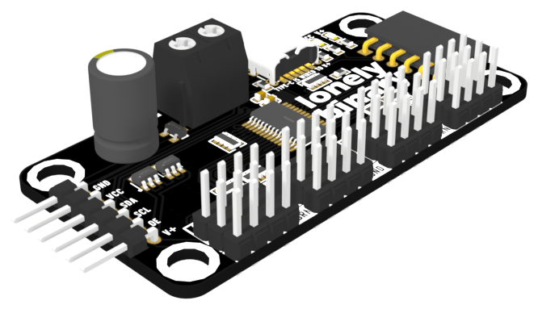

# PCA9685 16-Channel 12-Bit PWM Servo Driver

Sixteen servo channels on two I²C wires, powered from USB-C or a screw
terminal. This directory holds the example code. Everything else is on the
learn site:

| | |
| --- | --- |
| Start here | [learn.lonelybinary.com/p/pca9685](https://learn.lonelybinary.com/p/pca9685) — the box, the quick reference PDF, the files |
| Handbook | [/manuals/pca9685](https://learn.lonelybinary.com/manuals/pca9685) — thirteen short articles, from the first servo to chaining boards |
| The board in 3D | [/3d/pca9685](https://learn.lonelybinary.com/3d/pca9685) — every pin and every part |
| 3D model, STEP, drawing | [cad release pca9685-v1.0](https://github.com/Lonely-Binary/cad/releases/tag/pca9685-v1.0) |
| Chip datasheet | [PCA9685, NXP, Rev. 4](https://www.nxp.com/docs/en/data-sheet/PCA9685.pdf) |

## Before you wire it

Two rules, and the handbook explains both:

- **`V+` runs the servos, `VCC` runs the chip.** Feed `V+` from a 5 V adapter
  into the USB-C socket or the terminal, never from a computer's USB port.
  6 V at most.
  [V+ and VCC](https://learn.lonelybinary.com/manuals/pca9685/v-plus-and-vcc)
- **`VCC` sets the voltage on `SDA` and `SCL`**, because the board's pull-ups
  go to it. Wire `VCC` to 3V3 on an ESP32 or a Pico, 5V on an Uno.

## Examples

| Sketch | What it does |
| --- | --- |
| [01-single-servo](examples/arduino/01-single-servo) | One servo on channel 0, two positions. Start here. |
| [02-sweep-all](examples/arduino/02-sweep-all) | Finds the board on the bus, then sweeps all sixteen channels together. |
| [03-serial-console](examples/arduino/03-serial-console) | Type `5 120` to send channel 5 to 120°. Also scans the bus and decodes the address pads. |
| [04-multi-board-hotplug](examples/arduino/04-multi-board-hotplug) | Two boards, 32 channels, boards detected as they are plugged and unplugged. |
| [micropython](examples/micropython) | A small driver with no library dependency, and the same sweep. |

The PlatformIO version is in [examples/platformio](examples/platformio). How
to build each one is in [examples/README.md](examples/README.md), and the
handbook walks through the first sketch line by line in
[The first servo](https://learn.lonelybinary.com/manuals/pca9685/first-servo).

If nothing moves, the two LEDs beside the USB-C socket say where to look:
[When nothing moves](https://learn.lonelybinary.com/manuals/pca9685/when-nothing-moves).
