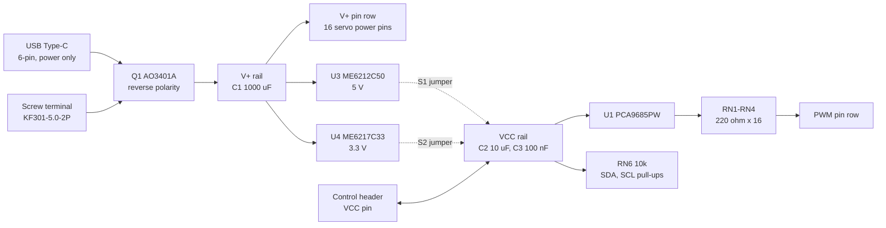

# Hardware reference

Everything below was traced from the board's own fabrication data — the net list
in the Gerber archive and the bill of materials — rather than copied from a
similar board. The raw net list is in [`../hardware/netlist.txt`](../hardware/netlist.txt)
if you want to check any of it.

## Block diagram

## Power input

The USB-C socket and the screw terminal land on the same node. That node goes
through Q1 and becomes `V+`.

Q1 is an AO3401A P-channel MOSFET wired the usual way for high-side reverse
protection: drain on the input, source on `V+`, gate straight to ground. Connect
the supply the right way round and the body diode conducts first, the source
rises, VGS goes several volts negative and the channel turns hard on.
Connect it backwards and VGS is zero, the channel stays off and the
body diode is reverse biased. Nothing downstream sees the reversed supply.

The Type-C connector is a six-pin part: VBUS, CC1, CC2 and ground, with no data
lines at all. CC1 and CC2 each have a 5.1 kΩ pull-down (R17, R18), which is what
makes a USB-C charger offer 5 V. There is no negotiation beyond that and no way
for the board to talk to a host — which is why the silkscreen says not to plug
it into a computer.

C1 is 1000 µF, 10 V, 8 × 12 mm, sitting directly on `V+`. It is there to
swallow the current step when several servos start moving at the same instant.

## The two rails

`V+` and `VCC` are separate. They touch at exactly two places, both optional:

| Jumper | Bridges | Regulator |
| --- | --- | --- |
| `S1`, marked `5V` | U3 output to `VCC` | ME6212C50, 5 V |
| `S2`, marked `3V3` | U4 output to `VCC` | ME6217C33, 3.3 V |

Both regulators have their enable pins tied to `V+`, so both are running
whenever the board is powered. Their outputs simply go nowhere until you bridge
a jumper. Bridging **both** would short 5 V into 3.3 V; bridge one or neither.

| | ME6212C50 (U3) | ME6217C33 (U4) |
| --- | --- | --- |
| Output | 5.0 V | 3.3 V |
| Maximum output current | 350 mA (VIN 4.3 V) | 800 mA (VIN ≥ VOUT + 1.0 V) |
| Dropout | 100 mV at 100 mA | 100 mV at 300 mA |
| Operating input range | 2 V to 6.0 V | 2 V to 6.5 V |

The 6.0 V input ceiling on U3 is the reason `V+` is limited to 6 V. Past that
the regulator is outside its rated range, and with `S1` bridged its output is
wired to the PCA9685's VDD pin, whose absolute maximum is 6.0 V.

Note the dropout when you plan a supply. A 5 V adapter into the `5V` jumper does
not give you 5 V on `VCC` — it gives you 5 V minus dropout, sagging further as
current rises. If you want a solid 5 V logic rail, feed `VCC` from your
microcontroller's own 5 V pin instead. The 3.3 V jumper has a full 1.7 V of
headroom off a 5 V supply and behaves properly.

`VCC` is decoupled by C2 (10 µF) and C3 (100 nF).

## The PCA9685

| Pin | Net | Notes |
| --- | --- | --- |
| 1–5, 24 | `A0`–`A4`, `A5` | Each has a 10 kΩ pull-down and a solder jumper to `VCC` |
| 6–13, 15–22 | `LED0`–`LED15` | Each through 220 Ω to its header pin |
| 14, 25 | `VSS`, `EXTCLK` | Both to ground — the external clock input is unused |
| 23 | `OE` | 10 kΩ pull-down (R19), also on both control headers |
| 26, 27 | `SCL`, `SDA` | 10 kΩ pull-up to `VCC` (RN6), also on both control headers |
| 28 | `VDD` | `VCC` |

`EXTCLK` grounded means the chip always runs on its internal oscillator. The
`EXTCLK` bit in MODE1 is a sticky bit — setting it on this board would stop the
PWM until a power cycle. Leave it alone.

`OE` idles low, so the outputs are enabled as soon as the chip is out of sleep.
Pulling `OE` high disables all sixteen channels in hardware, faster and more
reliably than writing registers, and it is the right way to build a kill switch.

### The 220 Ω series resistors

RN1 to RN4 are four-element 220 Ω arrays, one element per channel, between the
PCA9685 output pin and the header. Three consequences:

- A servo signal input is high impedance. 220 Ω in front of it changes nothing.
- You can hang an LED straight off a channel with no other parts. Wire it from
  `V+` or `VCC` down to the channel pin so the chip sinks the current: at 5 V a
  red LED then draws about 14 mA, inside the 25 mA sink rating. Wiring it the
  other way round asks the chip to *source*, and it is only rated for 10 mA
  that way.
- A shorted channel cannot pull more than about 23 mA, so a slipped probe does
  not take the chip with it.

### The I²C pull-ups

RN6 carries two 10 kΩ pull-ups from `SDA` and `SCL` to `VCC`. They are fitted on
every board, which matters when you cascade: four boards on one bus put four
10 kΩ resistors in parallel, or 2.5 kΩ. That is still a sane value. Eight boards
gives 1.25 kΩ, which at 3.3 V is 2.6 mA — inside what an ESP32 or a PCA9685 can
sink, but getting close to the point where you would want to unfit some of them.

Because the pull-ups terminate on `VCC`, `VCC` sets the bus voltage. This is the
single most important fact about the board: a 5 V `VCC` drives 5 V onto `SDA`
and `SCL`, and most modern microcontrollers are not 5 V tolerant.

## Headers

Both control headers carry the same six signals in the same order, so a board's
right-edge socket accepts the next board's left-edge pins directly.

| Silkscreen, top to bottom | Signal |
| --- | --- |
| `GND` | Ground |
| `VCC` | Logic supply, 3 V to 5 V |
| `SDA` | I²C data |
| `SCL` | I²C clock |
| `OE` | Output enable, active low. High disables all channels |
| `V+` | Servo supply, 6 V maximum |

The servo field is three rows of sixteen 2.54 mm pins:

| Row | Silkscreen | Signal |
| --- | --- | --- |
| Front | `PWM` / `YELLOW` | Channel output |
| Middle | `V+` / `RED` | Servo supply |
| Back | `GND` / `BROWN` | Ground |

Channels are numbered 0 to 15 left to right, printed above the row.

## Mechanical

| | |
| --- | --- |
| Board | 64.0 × 32.0 mm |
| Mounting holes | Four, Ø4.8 mm, unplated |
| Hole positions | 4.0 mm in from each edge — 56.0 × 24.0 mm between centres |
| Screw terminal pitch | 5.0 mm |
| Header pitch | 2.54 mm |

Ø4.8 mm clears an M4 screw. An M3 screw needs a washer.

Front, side and underside renders are in
[`../images/renders`](../images/renders), and a GLB of the assembled board is in
[`../3d`](../3d).

## Bill of materials

| Ref | Qty | Part | Function |
| --- | --- | --- | --- |
| U1 | 1 | PCA9685PW,118 | 16-channel PWM controller |
| U2 | 1 | KF301-5.0-2P | Screw terminal, 5.0 mm |
| U3 | 1 | ME6212C50M5G | 5 V regulator |
| U4 | 1 | ME6217C33M5G | 3.3 V regulator |
| U12 | 1 | PM254-1-06-W-8.5 | 6-pin female socket, right edge |
| USB1 | 1 | TYPE-C 6P (073) | USB-C power inlet |
| H3 | 1 | HX PZ2.54-1x6P WZ | 6-pin right-angle male header, left edge |
| H1, H2, H4–H13 | 12 | 1×4 2.54 mm headers | Servo field, 3 rows × 16 |
| Q1 | 1 | AO3401A | Reverse polarity protection |
| C1 | 1 | ERA10V1000M8X12 | 1000 µF, 10 V bulk on `V+` |
| C2, C3 | 2 | 10 µF, 100 nF | `VCC` decoupling |
| RN1–RN4 | 4 | 220 Ω array | Channel series resistors |
| RN5, RN6 | 2 | 10 kΩ array | Address pull-downs, I²C pull-ups |
| R17, R18 | 2 | 5.1 kΩ | USB-C CC pull-downs |
| R19 | 1 | 10 kΩ | `OE` pull-down |
| R20, R21 | 2 | 5.1 kΩ | LED series resistors |
| LED1, LED2 | 2 | 0603 red, blue | `VCC` and `V+` indicators |
| A0–A5, S1, S2 | 8 | Solder jumper | Address and regulator selection |

The machine-readable version, with manufacturer and supplier part numbers, is in
[`../hardware/bom.csv`](../hardware/bom.csv).
